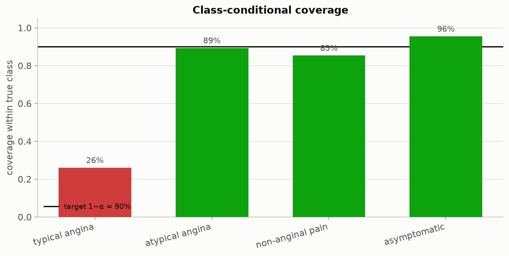

# Federated Conformal Prediction for Cross-Site Clinical Data

**A working, fully-tested instrument for a question every cross-institution data
project eventually has to answer: once the data arrives, can you actually trust
it the way you trust your own?**

Hands-on toolkit for the workshop **"Beyond Interoperability: Hands-On Federated
ML for Research Data Curation Infrastructure."**

Interoperability — the ability of systems to exchange, parse, and load each
other's data — is a solved problem for most modern schemas. It is not the same
problem as *comparability*. Two hospitals can use the identical column, in the
identical format, and still mean something different by it: one records serum
cholesterol on every patient, another almost never does. When that kind of
site-level heterogeneity goes undetected, a model trained at one institution can
fail *silently* at another — **confident but wrong**, the worst failure mode for
cross-organization deployment, because nothing about the model's own output warns
you it has happened. This toolkit exists to catch that failure before it reaches
a clinician, a researcher, or a downstream pipeline.

It pairs two ideas to do it, both implemented from scratch in readable NumPy so
every step is inspectable, not just importable:

1. **Conformal prediction** (Angelopoulos & Bates, 2022) — turn any model's
   heuristic confidence into prediction sets with a *distribution-free* coverage
   guarantee, then use that guarantee as a measuring instrument: calibrate at one
   site, deploy at another, and *watch the guarantee break* by exactly the amount
   the two sites disagree.
2. **Federated learning** (a transparent FedAvg simulator) — train one shared
   model across hospitals without ever moving raw patient records.

The demonstrator is the **UCI Heart Disease** dataset, loaded from its four
*original* hospital source files, not a pre-cleaned mirror — one of the very few
open clinical datasets where independent hospitals filled out the literal same
case-report form (Cleveland, Hungary, Switzerland, V.A. Long Beach), which makes
every difference this toolkit measures a genuine site effect rather than an
artifact of how a demo was constructed.

**Status:** 10/10 automated correctness tests passing · all 8 notebooks execute
end-to-end with zero errors · 32 figures, every one reproducible from a single
script call · a 30+ page written report (below) walking through the full method,
math, and results.

---

## The one-picture summary

A conformal predictor calibrated at Cleveland hits its 90% coverage target at
Cleveland, Hungary and the V.A. — and silently drops to **71%** when deployed at
Switzerland, the one hospital the federation never trained on:


Pooled across all four hospitals, coverage looks like a clean 90%. Reported *per
site*, a 19-point failure is impossible to miss. That gap — invisible in the
aggregate, obvious the moment you disaggregate — is the curation signal this
whole toolkit is built to surface automatically, on any model, at any site.

---

## Results at a glance

Four independent, reproducible findings, each backed by a figure and a script
you can re-run yourself:

| Finding | Evidence | Where |
|---|---|---|
| A model's coverage guarantee can drop **19 points** (90% → 71%) at a site it never saw, while the pooled number still reads 90% | `figures/09_coverage_by_site.png`, `figures/08_transfer_matrix.png` | Notebook 04, `scripts/run_end_to_end_pipeline.py` |
| The four hospitals are almost perfectly separable from clinical features alone (domain-classifier AUC **0.88–1.00**) — a simple cross-validated classifier can guess the hospital from features alone | `figures/05_domain_auc.png` | Notebook 01, `scripts/run_end_to_end_pipeline.py` |
| A rare class can be almost unprotected (**26% coverage** for the rarest chest-pain type) even while the overall marginal coverage sits right on the 90% target | `figures/cp/c04_class_conditional.png` | Notebook 06, `scripts/run_chest_pain_pipeline.py` |
| Two clinical variables (`ca`, `thal`) are missing for **80–99% of patients at every hospital except Cleveland** — a measurement gap far larger than the textbook cholesterol example, and easy to miss without explicitly checking | `figures/02_missingness.png` | Notebook 01, `heterogeneity.missingness_report` |
| The story replicates on an independent second task (predicting chest-pain type instead of disease severity) and a different nonconformity score (APS instead of LAC) | `figures/compare/task_comparison.png` | `scripts/compare_prediction_tasks.py` |

---

## What's inside

```
fedconformal-clinical/
├── src/fedconformal/
│   ├── data.py           # load the 4 raw UCI site files, impute, standardize, split by site
│   ├── conformal.py      # split conformal: LAC + APS score fns, quantile, predictors
│   ├── evaluate.py       # coverage, set size, size/feature/class-stratified coverage, Beta band
│   ├── federated.py      # NumPy FedAvg + centralized baseline (logistic/softmax model)
│   ├── heterogeneity.py  # label shift, missingness, JS divergence, domain-classifier AUC
│   ├── eda.py            # input-data exploration: target classes, feature dictionary, plots
│   ├── paper_figures.py  # recreations of the paper's explanatory figures (Fig 2,4,6,8,9,10,11)
│   └── viz.py            # every figure (colorblind-safe, fixed site colors, PCA/scatter views)
├── notebooks/            # 8 executed teaching notebooks (see below)
├── scripts/
│   ├── run_end_to_end_pipeline.py      # end-to-end pipeline -> writes every figure to figures/
│   ├── run_chest_pain_pipeline.py      # 4-class chest-pain-type pipeline -> writes figures/cp/
│   ├── run_exploratory_data_analysis.py# input-data exploration -> writes figures/eda/
│   ├── run_paper_figure_recreations.py # recreate the paper's figures -> writes figures/paper/
│   ├── compare_prediction_tasks.py     # head-to-head: 5-class disease vs 4-class chest-pain
│   ├── generate_notebooks.py           # regenerate the notebooks from the package API
│   └── generate_report.py              # regenerate the written report from every figure + result
├── tests/                # correctness checks (coverage == 1 - alpha, multiclass, 5-class task)
├── data/                 # the 4 original UCI per-site source files + provenance
├── figures/              # 32 generated PNGs (top-level + eda/, cp/, paper/, compare/)
└── report/                # Beyond_Interoperability_Report.docx — the full written report
```

### The notebooks (run in order)

| # | Notebook | You learn to… |
|---|----------|---------------|
| 00 | `00_input_data_exploration.ipynb` | **Start here.** Meet the 5-class disease-severity target (0 none … 4 critical), the 13-feature data dictionary, feature-vs-severity plots, and correlation structure. |
| 01 | `01_site_heterogeneity.ipynb` | Measure site heterogeneity; separate **true shift** from **measurement-induced** heterogeneity (Switzerland's unrecorded cholesterol, and `ca`/`thal` missing for 80-99% of patients outside Cleveland); read a domain-classifier AUC as a covariate-shift alarm. |
| 02 | `02_conformal_basics.ipynb` | Build split-conformal prediction sets in five lines; verify coverage == 1 − α; compare LAC vs APS. |
| 03 | `03_federated_training.ipynb` | Train a shared model with FedAvg without pooling data; hold a site out; compare to a centralized baseline. |
| 04 | `04_conformal_under_site_shift.ipynb` | **Capstone:** show the coverage guarantee breaking across sites; read the full transfer matrix; discuss mitigations for curation pipelines. |
| 05 | `05_recreating_paper_figures.ipynb` | Recreate the paper's explanatory diagrams (Figures 2, 4, 6, 8, 9, 10, 11) as editable, slide-ready figures. |
| 06 | `06_chest_pain_multiclass.ipynb` | **Multiclass:** predict the 4-class chest-pain type with a softmax FedAvg model; prediction sets over classes; class-conditional coverage exposes rare-class under-coverage. |
| 07 | `07_task_comparison.ipynb` | Puts the 5-class disease task and the 4-class chest-pain task side by side to check the heterogeneity story isn't an artifact of one label choice. |

---

## Two prediction tasks, one framework

The toolkit supports two classification tasks on the same four sites; choose with `task=`:

- **`"disease"`** (5-class, default) — the original UCI `num` target: heart disease presence and severity, `0` (none) through `4` (critical), from all 13 clinical features. This is what notebooks 00–04 use. (A binary "any disease" view is still available via `data.binarize_target`.)
- **`"cp"`** (4-class) — the **chest-pain type** (1 typical angina · 2 atypical angina · 3 non-anginal pain · 4 asymptomatic), predicted from the other 12 features. A prediction set is now a *set of chest-pain types*. See notebook 06 and `scripts/run_chest_pain_pipeline.py`.

```python
from fedconformal import data, federated, conformal
sites = data.load_sites(task="cp")                 # 4-class chest-pain task
fed   = federated.federated_averaging(sites, train_sites=["cleveland","hungarian","va"])
# federated_averaging picks a SoftmaxModel automatically when K > 2
```

The conformal predictors (`LACPredictor`, `APSPredictor`) and every metric are already
class-agnostic, so they work unchanged for any number of classes — which is exactly why
`scripts/compare_prediction_tasks.py` can run the identical heterogeneity analysis on both tasks and
show the same conclusion holds twice, not once.

## Quickstart

```bash
git clone <your-fork-url> fedconformal-clinical
cd fedconformal-clinical
python -m venv .venv && source .venv/bin/activate
pip install -r requirements.txt
pip install -e .            # optional: install the package

# reproduce every figure (add run_chest_pain_pipeline / run_exploratory_data_analysis /
# run_paper_figure_recreations / compare_prediction_tasks for the rest of the figure
# set — see What's Inside above)
python scripts/run_end_to_end_pipeline.py

# run the correctness tests
pytest -q            # or: python tests/test_conformal.py

# open the workshop notebooks
jupyter lab notebooks/

# regenerate the full written report from the current figures
python scripts/generate_report.py
```

No internet is required — the four-site dataset (original UCI per-site files) is
bundled under `data/`.

---

## A few of the figures

| Site heterogeneity | Measurement heterogeneity | Cross-site coverage transfer | The rare-class blind spot |
|---|---|---|---|
|  |  |  |  |

---

## The full written report

`report/Beyond_Interoperability_Report.docx` is a companion technical report built
directly from this codebase — no claim in it is hand-written without a script or
notebook behind it. It walks through, in plain language before any formula:

1. **Why conformal prediction helps with site heterogeneity** — the "confident but
   wrong" failure mode, what a prediction set is, and why per-site coverage is the
   number that matters, not the pooled one.
2. **The mathematics**, explained before each formula, with a code-to-figure map
   naming exactly which function in `src/fedconformal/` produces which result.
3. **Why this dataset is an ideal interoperability testbed** — full site, missingness,
   label-shift and domain-AUC tables, plus two new scatterplots (site-separability via
   PCA, and age-vs-max-heart-rate) that were missing from the original figure set and
   were added specifically to make the covariate-shift story visible, not just numeric.
4. **An honest pipeline justification** — what's solid today, and concretely what a
   production (rather than workshop) deployment should add next: calibration/reliability
   diagrams, subgroup-stratified coverage, a missingness-indicator feature, an
   implemented mitigation (not just a posed exercise), and a truly external validation
   site.

Regenerate it any time with `python scripts/generate_report.py` — it re-embeds whatever
is currently in `figures/`, so it never drifts out of sync with the code.

---

## The core concepts (for reference)

**Split conformal prediction.** Reserve a calibration set. Compute a nonconformity
score `s(x, y)` (we use `s = 1 − f(x)_y`). Take the finite-sample-corrected
quantile `q̂ = Quantile(s₁,…,sₙ; ⌈(n+1)(1−α)⌉/n)`. The prediction set is
`C(x) = { y : s(x, y) ≤ q̂ }`. Then, *if calibration and test data are
exchangeable*, `P(Y ∈ C(X)) ≥ 1 − α`.

**Why it matters here.** Across hospitals, exchangeability fails. The guarantee is
also only *marginal*: a pooled 90% can hide a site at 71%, or a rare class at 26%
(class/feature-stratified coverage exposes both). Measuring the per-site or
per-class coverage drop tells a curation team *where* integration is unsafe —
before a model is trusted on the other side.

**Distinguishing shift from measurement artifact.** `heterogeneity.py` provides
label-shift, missingness, Jensen-Shannon divergence, and domain-classifier-AUC
diagnostics so you can tell a genuinely sicker population (Switzerland's high
prevalence, 94% vs. Hungary's 36%) apart from a broken measurement channel
(Switzerland's unrecorded cholesterol, or the much larger `ca`/`thal` gap that
affects every non-Cleveland site).

---

## Extending this to your own site data

The code is written so you can drop in your own multi-site table:

1. Provide an `(X, y)` per site and wrap each in `fedconformal.data.SiteData`.
2. Reuse `federated.federated_averaging`, `conformal.LACPredictor` /
   `APSPredictor`, and every metric in `evaluate.py` unchanged.
3. Run `heterogeneity.domain_auc_matrix` first — if AUC ≈ 0.5 your sites are
   exchangeable and coverage should transfer; near 1.0, expect (and measure) the
   drop.

For richer real-world silos (e.g. ICU data across hospitals) see the
`eICU` collaborative database and the `FLamby` cross-silo benchmark, both cited in
`docs/DATA_SOURCES.md`.

---

## Citation

If you use this material, please cite the underlying works:

- A. N. Angelopoulos and S. Bates. *A Gentle Introduction to Conformal Prediction
  and Distribution-Free Uncertainty Quantification.* arXiv:2107.07511, 2022.
- R. Detrano et al. *International application of a new probability algorithm for
  the diagnosis of coronary artery disease.* Am. J. Cardiology, 1989 (UCI Heart
  Disease dataset).

## License

MIT — see `LICENSE`.
