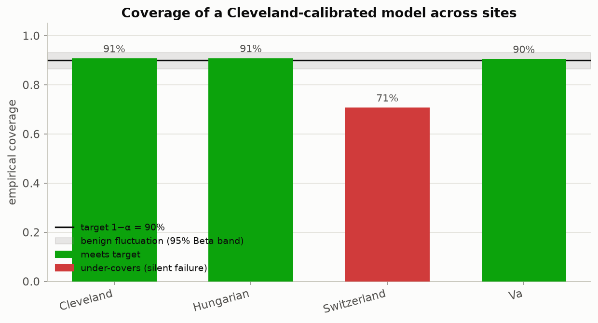
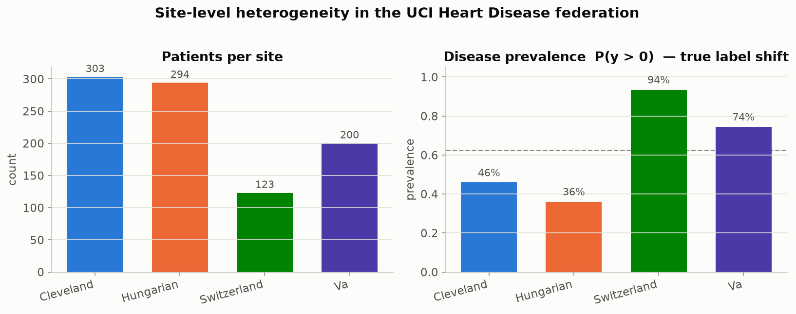
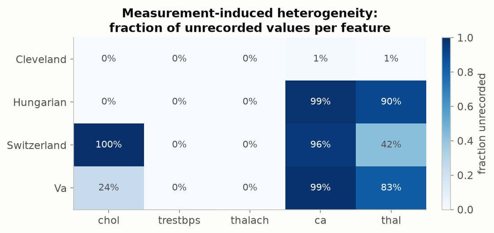
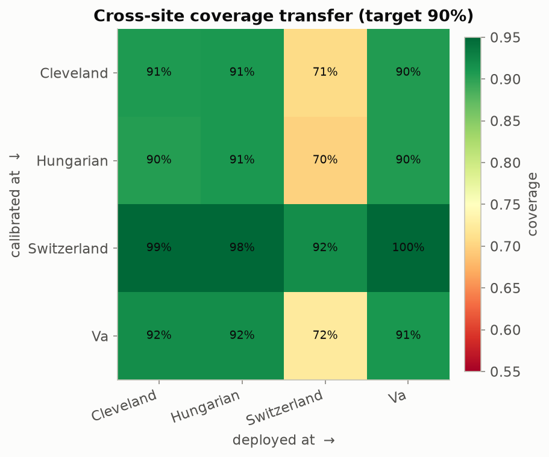

# Federated Conformal Prediction for Cross-Site Clinical Data

Hands-on toolkit for the workshop **"Beyond Interoperability: Hands-On Federated
ML for Research Data Curation Infrastructure."**

Interoperability lets clinical data cross institutional lines. It does **not**
guarantee that a variable *means* the same thing at every site. When data exhibit
distributional shift across institutions, a model trained at one site can fail
*silently* at another — **confident but wrong**, the worst failure mode for
cross-organization deployment.

This repo pairs two ideas to attack that problem, both implemented from scratch
in readable NumPy so every step is teachable:

1. **Conformal prediction** (Angelopoulos & Bates, 2022) — turn any model's
   heuristic confidence into prediction sets with a *distribution-free* coverage
   guarantee, and then *watch that guarantee break* across sites.
2. **Federated learning** (a transparent FedAvg simulator) — train a shared model
   across hospitals without moving raw patient data.

The demonstrator is the **UCI Heart Disease** dataset, one of the few *naturally
federated* public clinical datasets: the same case-report form collected at four
hospitals (Cleveland, Hungary, Switzerland, V.A. Long Beach).

---

## The one-picture summary

A conformal predictor calibrated at Cleveland hits its 90% coverage target at
Cleveland and Hungary — but silently drops to **71%** when deployed at
Switzerland, the site the federation never saw:



Pooled coverage looks perfect (90%). Reported *per site*, the failure is obvious.
That gap is the curation signal this workshop teaches you to measure.

---

## What's inside

```
fedconformal-clinical/
├── src/fedconformal/
│   ├── data.py           # load UCI Heart Disease, split into 4 hospital sites
│   ├── conformal.py      # split conformal: LAC + APS score fns, quantile, predictors
│   ├── evaluate.py       # coverage, set size, size/feature-stratified coverage, Beta band
│   ├── federated.py      # NumPy FedAvg + centralized baseline (logistic/softmax model)
│   ├── heterogeneity.py  # label shift, missingness, JS divergence, domain-classifier AUC
│   ├── eda.py            # input-data exploration: target classes, feature dictionary, plots
│   ├── paper_figures.py  # recreations of the paper's explanatory figures (Fig 2,4,6,8,9,10,11)
│   └── viz.py            # all workshop figures (colorblind-safe, fixed site colors)
├── notebooks/            # 6 executed teaching notebooks (see below)
├── scripts/
│   ├── run_demo.py       # end-to-end pipeline -> writes every figure to figures/
│   ├── run_eda.py        # input-data exploration -> writes figures/eda/
│   ├── run_paper_figures.py # recreate the paper's figures -> writes figures/paper/
│   ├── run_demo_cp.py    # 4-class chest-pain-type pipeline -> writes figures/cp/
│   └── build_notebooks.py# regenerate the notebooks from the package API
├── tests/                # correctness checks (coverage == 1 - alpha, multiclass)
├── data/                 # bundled 4-site raw UCI files + provenance
└── figures/              # generated PNGs
```

### The notebooks (run in order)

| # | Notebook | You learn to… |
|---|----------|---------------|
| 00 | `00_input_data_exploration.ipynb` | **Start here.** Meet the 5-class disease-severity target (0 none … 4 critical), the 13-feature data dictionary, feature-vs-severity plots, and correlation structure. |
| 01 | `01_site_heterogeneity.ipynb` | Measure site heterogeneity; separate **true shift** from **measurement-induced** heterogeneity (Switzerland's unrecorded cholesterol, and `ca`/`thal` missing for 80-99% of patients outside Cleveland); read a domain-classifier AUC as a covariate-shift alarm. |
| 02 | `02_conformal_basics.ipynb` | Build split-conformal prediction sets in five lines; verify coverage == 1 − α; compare LAC vs APS. |
| 03 | `03_federated_training.ipynb` | Train a shared model with FedAvg without pooling data; hold a site out; compare to a centralized baseline. |
| 04 | `04_conformal_under_site_shift.ipynb` | **Capstone:** show the coverage guarantee breaking across sites; read the full transfer matrix; discuss mitigations for curation pipelines. |
| 05 | `05_recreating_paper_figures.ipynb` | Recreate the paper's explanatory diagrams (Figures 2, 4, 6, 8, 9, 10, 11) as editable, slide-ready figures. |
| 06 | `06_multiclass_cp.ipynb` | **Multiclass:** predict the 4-class chest-pain type with a softmax FedAvg model; prediction sets over classes; class-conditional coverage exposes rare-class under-coverage. |

---

## Two prediction tasks

The toolkit supports two classification tasks on the same data; choose with `task=`:

- **`"disease"`** (5-class, default) — the original UCI `num` target: heart disease presence and severity, `0` (none) through `4` (critical), from all 13 clinical features. This is what notebooks 00–04 use. (A binary "any disease" view is still available via `data.binarize_target`.)
- **`"cp"`** (4-class) — the **chest-pain type** (1 typical angina · 2 atypical angina · 3 non-anginal pain · 4 asymptomatic), predicted from the other 12 features. A prediction set is now a *set of chest-pain types*. See notebook 06 and `scripts/run_demo_cp.py`.

```python
from fedconformal import data, federated, conformal
sites = data.load_sites(task="cp")                 # 4-class chest-pain task
fed   = federated.federated_averaging(sites, train_sites=["cleveland","hungarian","va"])
# federated_averaging picks a SoftmaxModel automatically when K > 2
```

The conformal predictors (`LACPredictor`, `APSPredictor`) and every metric are already
class-agnostic, so they work unchanged for any number of classes.

## Quickstart

```bash
git clone <your-fork-url> fedconformal-clinical
cd fedconformal-clinical
python -m venv .venv && source .venv/bin/activate
pip install -r requirements.txt
pip install -e .            # optional: install the package

# reproduce every figure
python scripts/run_demo.py

# run the correctness tests
pytest -q            # or: python tests/test_conformal.py

# open the workshop notebooks
jupyter lab notebooks/
```

No internet is required — the four-site dataset (original UCI per-site files) is
bundled under `data/`.

---

## A few of the figures

| Site heterogeneity | Measurement heterogeneity | Cross-site coverage transfer |
|---|---|---|
|  |  |  |

---

## The core concepts (for reference)

**Split conformal prediction.** Reserve a calibration set. Compute a nonconformity
score `s(x, y)` (we use `s = 1 − f(x)_y`). Take the finite-sample-corrected
quantile `q̂ = Quantile(s₁,…,sₙ; ⌈(n+1)(1−α)⌉/n)`. The prediction set is
`C(x) = { y : s(x, y) ≤ q̂ }`. Then, *if calibration and test data are
exchangeable*, `P(Y ∈ C(X)) ≥ 1 − α`.

**Why it matters here.** Across hospitals, exchangeability fails. The guarantee is
also only *marginal*: a pooled 90% can hide a site at 82% (feature-stratified
coverage exposes this). Measuring the per-site coverage drop tells a curation team
*where* integration is unsafe — before a model is trusted on the other side.

**Distinguishing shift from measurement artifact.** `heterogeneity.py` provides
label-shift, missingness, Jensen-Shannon divergence, and domain-classifier-AUC
diagnostics so you can tell a genuinely sicker population (Switzerland's high
prevalence) apart from a broken measurement channel (Switzerland's unrecorded
cholesterol).

---

## Extending this to your own site data

The code is written so you can drop in your own multi-site table:

1. Provide an `(X, y)` per site and wrap each in `fedconformal.data.SiteData`.
2. Reuse `federated.federated_averaging`, `conformal.LACPredictor` /
   `APSPredictor`, and every metric in `evaluate.py` unchanged.
3. Run `heterogeneity.domain_auc_matrix` first — if AUC ≈ 0.5 your sites are
   exchangeable and coverage should transfer; near 1.0, expect (and measure) the
   drop.

For richer real-world silos (e.g. ICU data across hospitals) see the
`eICU` collaborative database and the `FLamby` cross-silo benchmark, both cited in
`docs/DATA_SOURCES.md`.

---

## Citation

If you use this material, please cite the underlying works:

- A. N. Angelopoulos and S. Bates. *A Gentle Introduction to Conformal Prediction
  and Distribution-Free Uncertainty Quantification.* arXiv:2107.07511, 2022.
- R. Detrano et al. *International application of a new probability algorithm for
  the diagnosis of coronary artery disease.* Am. J. Cardiology, 1989 (UCI Heart
  Disease dataset).

## License

MIT — see `LICENSE`.
